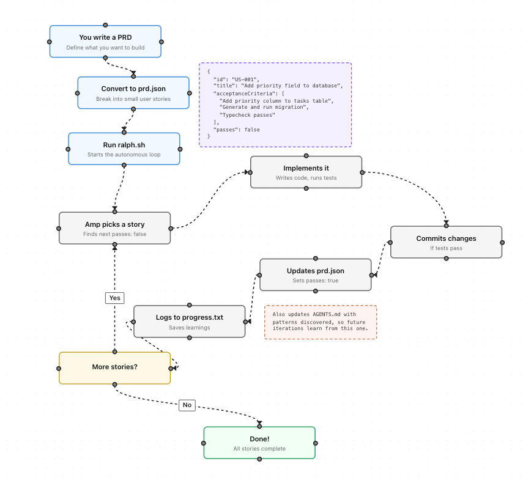

# How I Use Ralph to Build a Full SaaS with Claude Code

This is my adaptation of [Ralph](https://www.aihero.dev/getting-started-with-ralph), an iterative AI development technique created by AI Hero. I'm using it with Claude Code to build [Media Janitor](https://mediajanitor.com), a SaaS for Plex/Jellyfin media server owners.

The core idea: **make AI work like a real software engineer**, not just a code generator.

## What Makes a Good Engineer?

Good engineers don't just write code. They work in tight feedback loops:

1. Write a test
2. Run it (it fails)
3. Write the code
4. Run it again (it passes)
5. Commit
6. Repeat

They make small, verifiable changes. They don't break existing functionality. They learn from their mistakes.

**AI without structure produces chaos.** Random code generation, context lost between sessions, no way to verify correctness.

**AI with structure produces predictable results.** Clear tasks, automated verification, accumulated knowledge.

The hardest part? **Writing a good PRD.** If you get that right, execution becomes mechanical.

## The Workflow



There are two phases: what **you** do, and what **Ralph** does autonomously.

### Your Job: Planning

**1. Write a PRD** (using `/prd` skill)

Break your feature into user stories. Each story must:
- Fit in ONE Claude context window (this is critical)
- Have specific, verifiable acceptance criteria
- Include "Typecheck passes" and "Unit tests pass"
- Include "Verify in browser" for UI changes

**2. Convert to prd.json** (using `/ralph-init` skill)

Transform your human-readable PRD into a machine-readable format that Ralph can query:

```json
{
  "id": "US-001",
  "title": "Add priority field to database",
  "acceptanceCriteria": [
    "Add priority column to tasks table",
    "Generate and run migration",
    "Typecheck passes"
  ],
  "passes": false
}
```

### Ralph's Job: Execution

Once you run `./ralph-once.sh` (or `./afk-ralph.sh` for autonomous mode), Claude:

1. **Picks the next story** where `passes: false`
2. **Implements with TDD** - writes a failing test first, then the code
3. **Runs quality checks** - pytest, mypy, npm test, npm run check
4. **Verifies in Docker** - because unit tests alone aren't enough
5. **Updates prd.json** - sets `passes: true`
6. **Commits** with a clear message
7. **Logs learnings** to progress.txt
8. **Updates CLAUDE.md** with patterns discovered
9. **Loops** until all stories are done

## The Key Skills

### `/prd` - The Hardest Part

Writing a good PRD is 80% of the work. Bad PRD = AI spinning in circles. Good PRD = smooth execution.

**Sizing is everything.** Each story must complete in one session. If it's too big, split it:
1. Data layer first (models, migrations)
2. Backend logic (services, APIs)
3. Frontend UI (pages, components)
4. Integration (connecting pieces)

**Acceptance criteria must be verifiable.** Not "works correctly" - but "returns 401 when token is invalid" or "displays error toast on API failure."

### `/ralph-init` - PRD to JSON

Converts your PRD to machine format. Validates sizing before Ralph starts. Assigns priorities so dependencies run first (data before backend, backend before frontend).

### `/exploratory-qa` - The Human-in-the-Loop QA

This is where humans stay involved.

Every 3-5 Ralph iterations, I run `/exploratory-qa`. Claude reviews the entire app for cross-cutting concerns that aren't visible when focused on single stories:

- Navigation consistency
- Error handling patterns
- Auth guards on protected routes
- UI coherence (styling, spacing)
- Security issues

It updates `SUGGESTIONS.md` with priority markers:

- **[P1]** - Needs human review. Should become a new PRD story.
- **[P2]** - Should fix soon, doesn't need PRD.
- **[P3]** - Nice to have, future improvement.

**Key insight: QA can't be fully automated.** P1 items need human judgment to decide if they're worth doing and how to prioritize them. This keeps me in the loop without requiring me to review every line of code.

## The Learning Loop

After each story, Claude captures what it learned in `CLAUDE.md`:

- "Always use async sessions in tests to match production"
- "Docker verification is critical - unit tests alone mask bugs"
- "Use bcrypt directly, not passlib, for Python 3.12+"

Future iterations benefit from past learnings. The project gets smarter over time.

## Why This Works

**Reduced feedback loop.** Tests run automatically. Failures are caught immediately. No waiting for human review to find bugs.

**No regressions.** Every change must pass existing tests. The AI can't break what already works.

**Autonomous but bounded.** Claude works within clear acceptance criteria. It can't go off on tangents because the task is clearly defined.

**Human judgment where needed.** PRD creation is human. P1 prioritization is human. The AI handles execution, humans handle direction.

## What I'm Still Improving

This is exploratory. I'm learning what works as I go.

The `/exploratory-qa` skill keeps finding new patterns to check. `SUGGESTIONS.md` grows with each review. Some P1 items become new stories, others get deprioritized.

The prompt in `prompt.md` has been refined many times based on what went wrong in previous iterations.

## How to Try It

### Human-in-the-Loop (Recommended)

Watch Claude work on one task at a time:

```bash
chmod +x ralph-once.sh
./ralph-once.sh
```

Review the commit, then run again for the next task.

### Autonomous Mode

Let Claude work unattended for N iterations:

```bash
chmod +x afk-ralph.sh
./afk-ralph.sh 5
```

### Files You Need

| File | Purpose |
|------|---------|
| `PRD.md` | Your user stories with `[ ]` checkboxes |
| `prd.json` | Machine-readable version for Ralph |
| `progress.txt` | Log of completed tasks |
| `CLAUDE.md` | Project context and accumulated learnings |
| `SUGGESTIONS.md` | QA observations with [P1]/[P2]/[P3] priorities |
| `prompt.md` | The execution prompt Ralph follows |
| `.claude/skills/prd/` | Skill for creating well-structured PRDs |
| `.claude/skills/ralph-init/` | Skill for converting PRD.md to prd.json |
| `.claude/skills/exploratory-qa/` | Skill for periodic QA reviews |

## Current Status

I'm building [Media Janitor](https://mediajanitor.com) using this workflow. So far:
- 18 user stories completed autonomously
- Patterns accumulated in CLAUDE.md
- QA observations tracked in SUGGESTIONS.md

It's not perfect, but it's productive. The AI works like an engineer, not a chatbot.

---

Based on: [AI Hero's Ralph](https://www.aihero.dev/getting-started-with-ralph) | Adapted for [Claude Code](https://claude.ai/claude-code)
